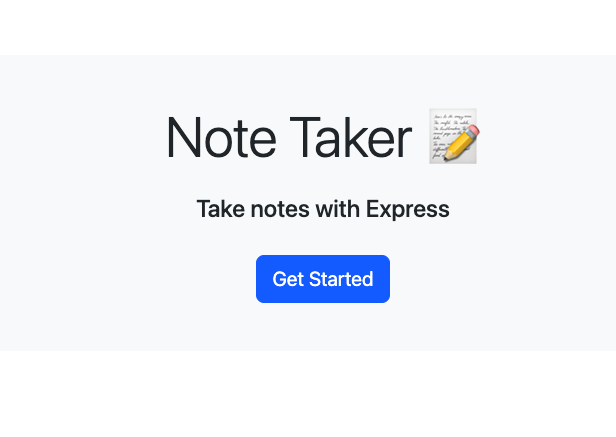
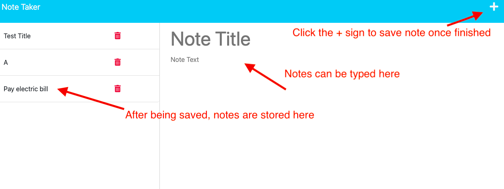

# module-eleven-challenge
Note Taker

## Description

The goal of this project was to create a note taker application. 

## Installation

N/A

## Usage

The application can be found by going to the following link: https://note-taker-bajones.herokuapp.com/

The usage of this application is to give users a simple note taker application where they can easily type out a notes title, description and save it. Future development will include giving functionality to the delete button so that notes can be deleted when they are no longer needed. 

## Credits

The starter code used for this project can be found at the following link: https://github.com/coding-boot-camp/miniature-eureka

## License

Please refer to the license in the repo